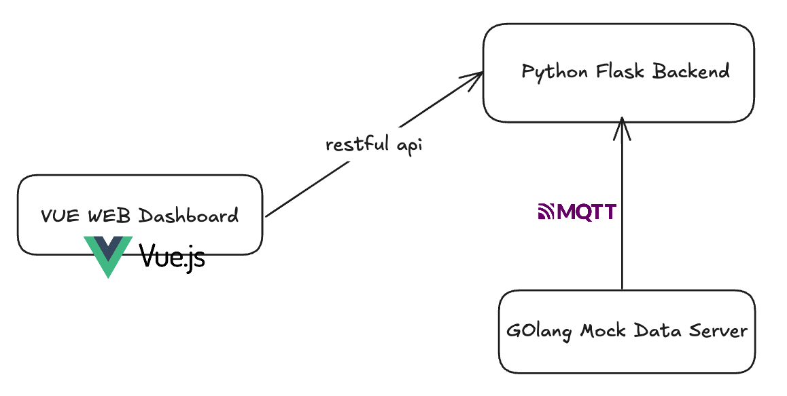
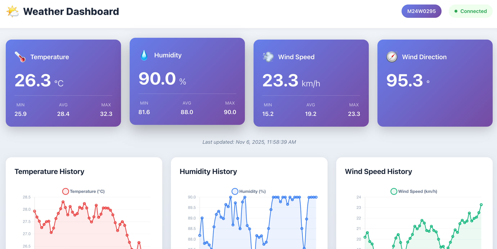

# Weather Dashboard

## Student Code: M24W0295

## Overview

This project is a comprehensive Weather Dashboard system that provides real-time weather monitoring and visualization capabilities. The system consists of multiple components working together to collect, process, and display weather data.

## System Architecture





## Components

### Python Backend (Flask)
- RESTful API server built with Flask
- Handles data processing and storage
- Provides API endpoints for weather data retrieval
- Manages communication between frontend and data sources

### Golang Mock Server
- MQTT-based data simulator
- Continuously publishes weather metrics to the Python backend via MQTT protocol
- Simulates real-time weather data including:
  - Temperature
  - Humidity
  - Wind Direction
  - Wind Speed

### Vue Frontend
- Web-based user interface built with Vue 3 + TypeScript
- Real-time dashboard with auto-refresh every 2 seconds
- Interactive weather cards with statistics
- Historical data visualization using Chart.js
- Responsive design for mobile and desktop
- Connection status indicator
- Communicates with Python backend via RESTful API

## Technology Stack

- **Backend**: Python 3 (Flask, Flask-CORS, paho-mqtt)
- **Data Simulation**: Golang 1.24 (paho.mqtt.golang)
- **Frontend**: Vue 3 + TypeScript + Vite
- **Visualization**: Chart.js
- **Styling**: Tailwind CSS
- **Communication Protocol**: MQTT (Mosquitto), RESTful API

## Features

- Real-time weather data collection
- MQTT-based data transmission
- RESTful API for data access
- Interactive web dashboard
- Multiple weather metrics monitoring (Temperature, Humidity, Wind Direction, Wind Speed)
- Historical data storage (last 100 readings)
- Statistical analysis (min, max, average)
- Smooth weather transitions for realistic simulation

## Quick Start

### Prerequisites
- Python 3.8+
- Go 1.24+
- Node.js 18+ (or pnpm)
- MQTT Broker (Mosquitto)

### Installation

1. **Install MQTT Broker**
   ```bash
   # macOS
   brew install mosquitto
   brew services start mosquitto

   # Ubuntu/Debian
   sudo apt-get install mosquitto mosquitto-clients
   sudo systemctl start mosquitto
   ```

2. **Install Python Dependencies**
   ```bash
   python3 -m venv venv
   source venv/bin/activate  # Windows: venv\Scripts\activate
   pip install -r requirements.txt
   ```

3. **Install Go Dependencies**
   ```bash
   go mod download
   ```

4. **Install Frontend Dependencies**
   ```bash
   cd frontend
   pnpm install  # or npm install
   cd ..
   ```

### Running the System

#### Option 1: Quick Start Script (Recommended)
```bash
chmod +x start.sh
./start.sh
```

#### Option 2: Manual Start

**Terminal 1 - Python Backend:**
```bash
source venv/bin/activate
python app.py
```

**Terminal 2 - Golang Mock Server:**
```bash
go run main.go
```

**Terminal 3 - Vue Frontend:**
```bash
cd frontend
pnpm dev  # or npm run dev
```

The application will be available at:
- **Frontend Dashboard**: http://localhost:3000
- **Backend API**: http://localhost:5000

### API Endpoints

Once running, access the following endpoints:

- **Health Check**: `GET http://localhost:5000/api/health`
- **Current Weather**: `GET http://localhost:5000/api/weather/current`
- **Historical Data**: `GET http://localhost:5000/api/weather/history?limit=100`
- **Statistics**: `GET http://localhost:5000/api/weather/stats`

### Testing

```bash
# Test current weather
curl http://localhost:5000/api/weather/current

# Test with formatting (requires jq)
curl http://localhost:5000/api/weather/current | jq

# Monitor MQTT messages directly
mosquitto_sub -h localhost -t "weather/data" -v
```

## Project Structure

```
WeatherDashboard/
├── frontend/                    # Vue.js frontend application
│   ├── src/
│   │   ├── components/         # Vue components
│   │   │   ├── WeatherCard.vue
│   │   │   └── WeatherChart.vue
│   │   ├── services/           # API service layer
│   │   │   └── weatherApi.ts
│   │   ├── App.vue             # Main app component
│   │   ├── main.ts             # Entry point
│   │   └── style.css           # Global styles
│   ├── package.json            # Frontend dependencies
│   ├── vite.config.ts          # Vite configuration
│   └── README.md               # Frontend documentation
├── app.py                      # Python Flask backend with MQTT subscriber
├── main.go                     # Golang MQTT mock data server
├── requirements.txt            # Python dependencies
├── go.mod                      # Go module dependencies
├── start.sh                    # Quick start script
├── Makefile                    # Build and run automation
├── SETUP.md                    # Detailed setup guide
├── IMPLEMENTATION.md           # Technical implementation details
├── .env.example                # Environment variables template
└── README.md                   # This file
```

## Data Flow

1. **Golang Mock Server** generates realistic weather data every 2 seconds
2. Data is published to MQTT broker on topic `weather/data`
3. **Python Flask Backend** subscribes to the MQTT topic
4. Received data is stored in memory (last 100 readings)
5. **Vue Frontend** fetches data via REST API and displays in real-time dashboard

## Weather Data Format

```json
{
  "temperature": 25.5,
  "humidity": 65.2,
  "wind_direction": 180.0,
  "wind_speed": 15.3,
  "timestamp": "2024-11-06T10:30:00Z"
}
```

## Documentation

- [SETUP.md](SETUP.md) - Detailed setup and troubleshooting guide
- [IMPLEMENTATION.md](IMPLEMENTATION.md) - Technical implementation details
- [frontend/README.md](frontend/README.md) - Frontend-specific documentation
- [.env.example](.env.example) - Configuration template

## Screenshots

The dashboard features:
- 4 animated weather cards showing real-time metrics
- Connection status indicator (green = connected, red = disconnected)
- 3 interactive charts showing historical data
- Responsive layout for all screen sizes
- Auto-refresh every 2 seconds

## Future Enhancements

- [ ] Add WebSocket support for even faster real-time updates
- [ ] Implement data persistence with database (PostgreSQL/MongoDB)
- [ ] Add user authentication and multi-user support
- [ ] Create weather alerts and notifications
- [ ] Add data export functionality (CSV, JSON)
- [ ] Implement weather forecasting
- [ ] Add geolocation support for multiple weather stations

